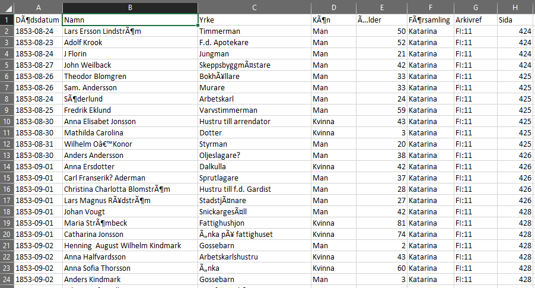
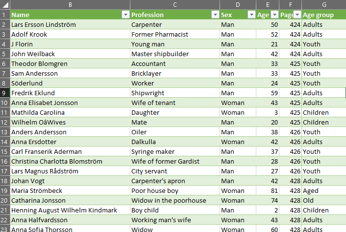
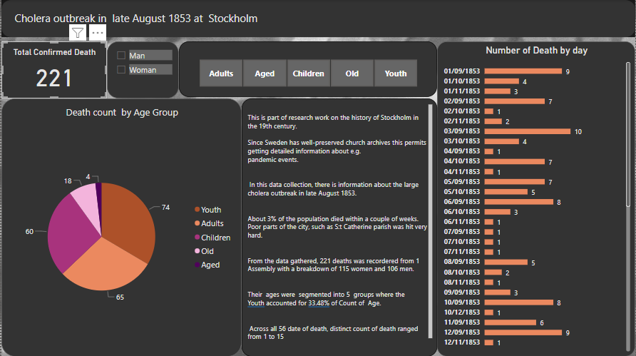

# CholeraDataVault
This project aims to provide a comprehensive and user-friendly toolkit for working with cholera-related data, ensuring data integrity and facilitating insightful 
visualization using power bi

Cholera Outbreak, Stockholm, 1853
This is part of research work on the history of Stockholm in the 19th century. Since Sweden has, well-preserved church archives this permits getting detailed 
information about e.g. pandemic events. In this data collection, I will start gathering information about the large cholera outbreak in late August 1853.
About 3% of the population died within a couple of weeks. Poor parts of the city, such as St Catherine parish was hit very hard. This is a page from the 
church records in the worst period in September:
https://sok.riksarkivet.se/bildvisning/C0055812_00226 For more information see: https://en.wikipedia.org/wiki/1853_Stockholm_cholera_outbreak
The data is collected from hand-written church records. The church was responsible for all population registration until around 1870. 
Only death records have been analysed. Since Cholera has around 40% CFR, we can assume a larger number of affected but surviving individuals

# Raw data in Swedish
The data contains 248 rows and 8 columns. The column name include date of death, name, profession, sex, age, assembly, 
archive reference and page numbers where individual’s information can be found. 248 deaths was recorded in this particular data received.
    

# Getting Started
Data can be imported from various file formats into Excel. After opening my excel, on the file menu, I clicked on ‘Open’ which allowed me to select the file
I performed data transformations using Excel functions and formulas

# 1. Data Sources and Pre-processing
Data Language conversion from Swedish to English:
With Google Translate within Google Sheets, the raw data initially presented in Swedish was effectively translated into English, making it accessible and 
comprehensible for analysis, reporting, or sharing with English-speaking stakeholders. This facilitated the utilization of the dataset in an English-speaking context.

# 2. Data Cleaning:
The name and profession columns had a few foreign characters removed and cleaned. For instance: €, ™, ?, -, ©. Shortcut: CTRL H (find and replace) 
This formula finds a stated character (which appear to be the incorrect representation of an apostrophe) and replaces with a specified character or nothing. 
The age column was categorized to ensure easy and simplified visualization. The intention of this is also take care of clumsy data graphics. 
Formula: =IF(E2>80,"Aged",IF(E2>60,"Old",IF(E2>40,"Adults",IF(E2>20,"Youth",IF(E2>=0,"Children"," "))))) 
The assembly and archive reference column were removed by selecting, right clicking and deleting. Cleaned data:

# 3. Data Visualization
After importing and cleaning data in excel, I transferred to my POWERBI for visualization.

